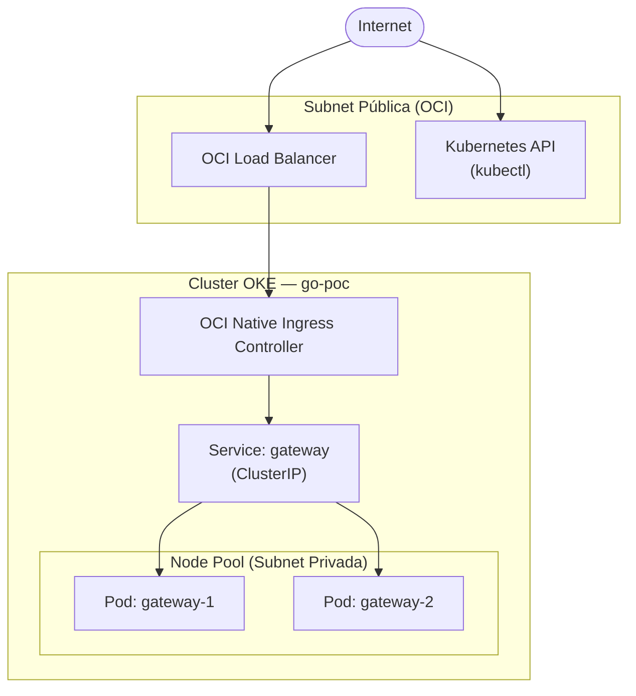

## Visão Geral

O cluster Kubernetes do GO corre no **Oracle Kubernetes Engine (OKE)**, com plano de controlo gerido pela Oracle Cloud Infrastructure (OCI) na região de Frankfurt (`eu-frankfurt-1`). A rede (VCN, subnets, gateways) é gerida por uma equipa separada e deve existir previamente à criação do cluster.

A infraestrutura é declarada em Terraform e organizada em dois módulos principais:

- **`oke`** — Cluster OKE com plano de controlo gerido
- **`node_pool`** — Pool de nós de trabalho (workers)

---

## Diagrama



---

## Cluster OKE

| Propriedade       | Valor                        |
|-------------------|------------------------------|
| Nome              | `iso-go-k8s-cluster`         |
| Versão Kubernetes | `v1.31.1`                    |
| Região OCI        | `eu-frankfurt-1` (Frankfurt) |
| CNI               | Flannel Overlay (VXLAN)      |
| CIDR Pods         | `10.244.0.0/16`              |
| CIDR Services     | `10.96.0.0/16`               |
| Endpoint API      | Público (subnet pública)     |

O endpoint do API Kubernetes está exposto na subnet pública para permitir acesso via `kubectl` fora da VCN. Em produção, considerar migrar para um endpoint privado acessível apenas via VPN ou bastion host.

---

## Node Pool

| Propriedade        | Valor (PoC)              |
|--------------------|--------------------------|
| Nome               | `iso-go-k8s-node-pool`   |
| Shape              | `VM.Standard.E4.Flex`    |
| OCPUs por nó       | 2                        |
| Memória por nó     | 8 GB                     |
| Nº de nós          | 1 (PoC)                  |
| Sistema operativo  | Oracle Linux 8 (x86_64)  |
| Subnet             | Privada (sem IP público)  |

Os nós não têm IP público — o tráfego de saída é encaminhado via NAT gateway. Para produção, aumentar `node_count` e `node_ocpus` conforme a carga esperada.

---

## Workloads

### Namespace

Todos os recursos do GO estão agrupados no namespace `go-poc`.

### Gateway

O `gateway` é o único serviço actualmente deployado. Actua como ponto de entrada HTTP para o cluster.

| Propriedade     | Valor                                              |
|-----------------|----------------------------------------------------|
| Imagem          | `ghcr.io/tmlmobilidade/go-gateway-poc:latest`      |
| Réplicas        | 2                                                  |
| Estratégia      | Rolling Update (maxUnavailable: 0, maxSurge: 1)    |
| Tipo de Service | ClusterIP                                          |
| Ingress         | OCI Native Ingress Controller (`native`)           |
| Load Balancer   | Flexible (10–100 Mbps)                             |

As duas réplicas são agendadas preferencialmente em nós distintos (anti-affinity) para garantir disponibilidade durante actualizações. Os probes de liveness e readiness verificam o endpoint `/health`.

---

## Gestão de Infraestrutura

O cluster é provisionado via **Terraform** em `infra/kubernetes/terraform/`. Os manifestos Kubernetes estão em `infra/kubernetes/manifests/`.

As imagens de contentor seguem a convenção:

```
ghcr.io/tmlmobilidade/go-<módulo>-<app>:<tag>
```
